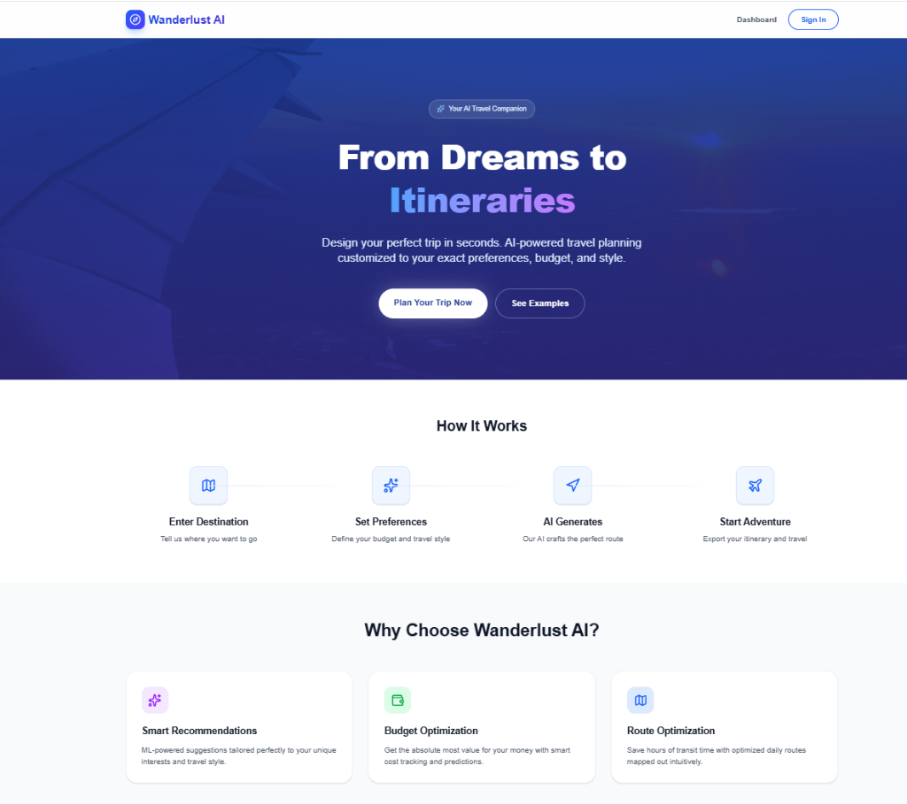
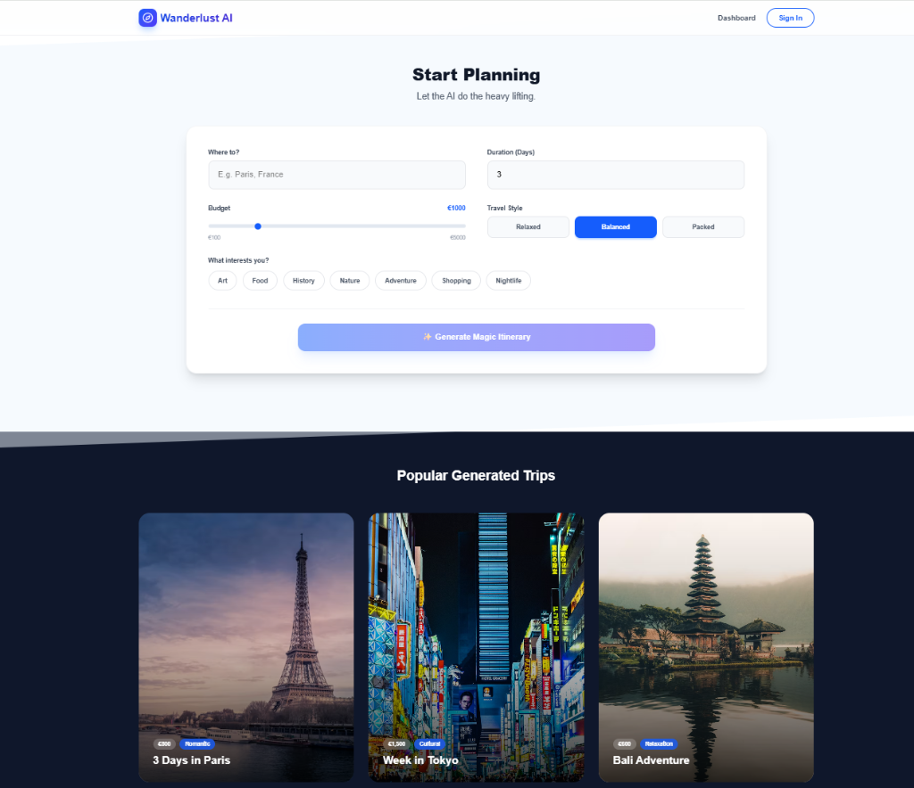
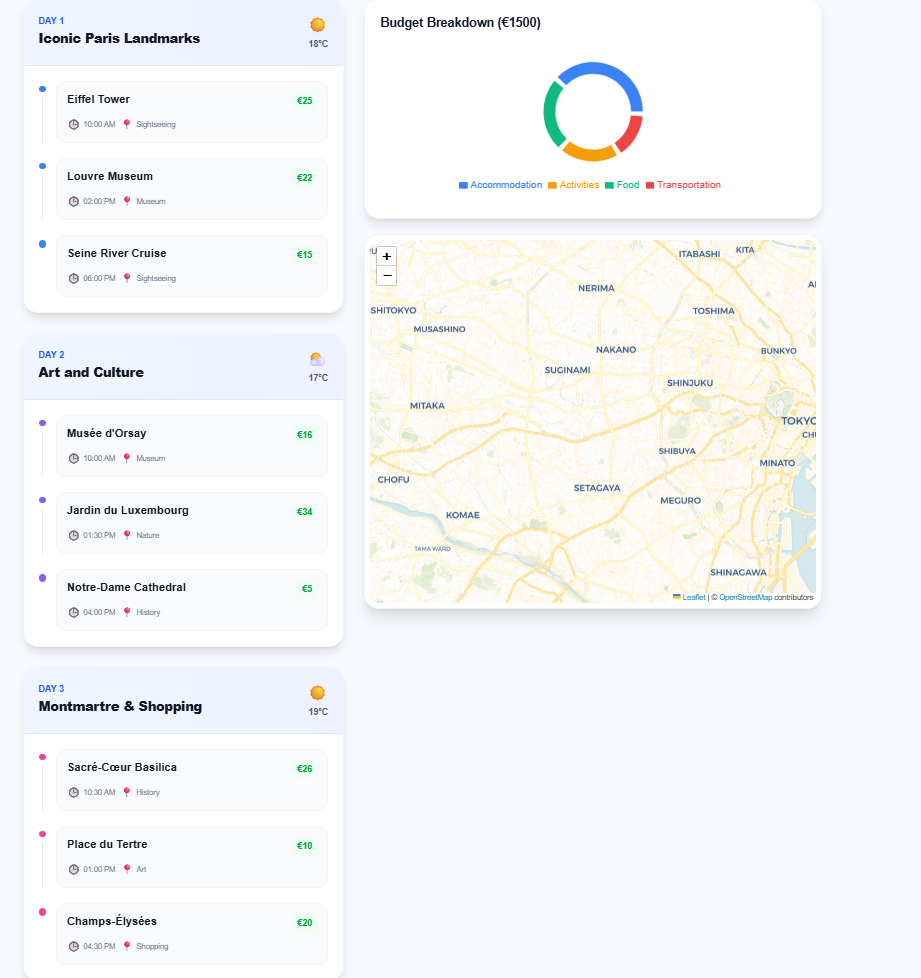
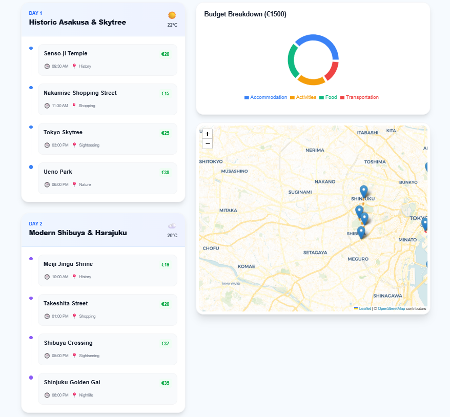
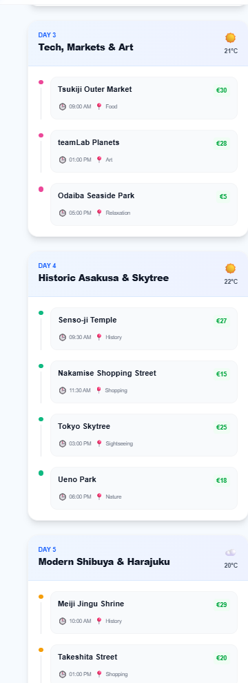
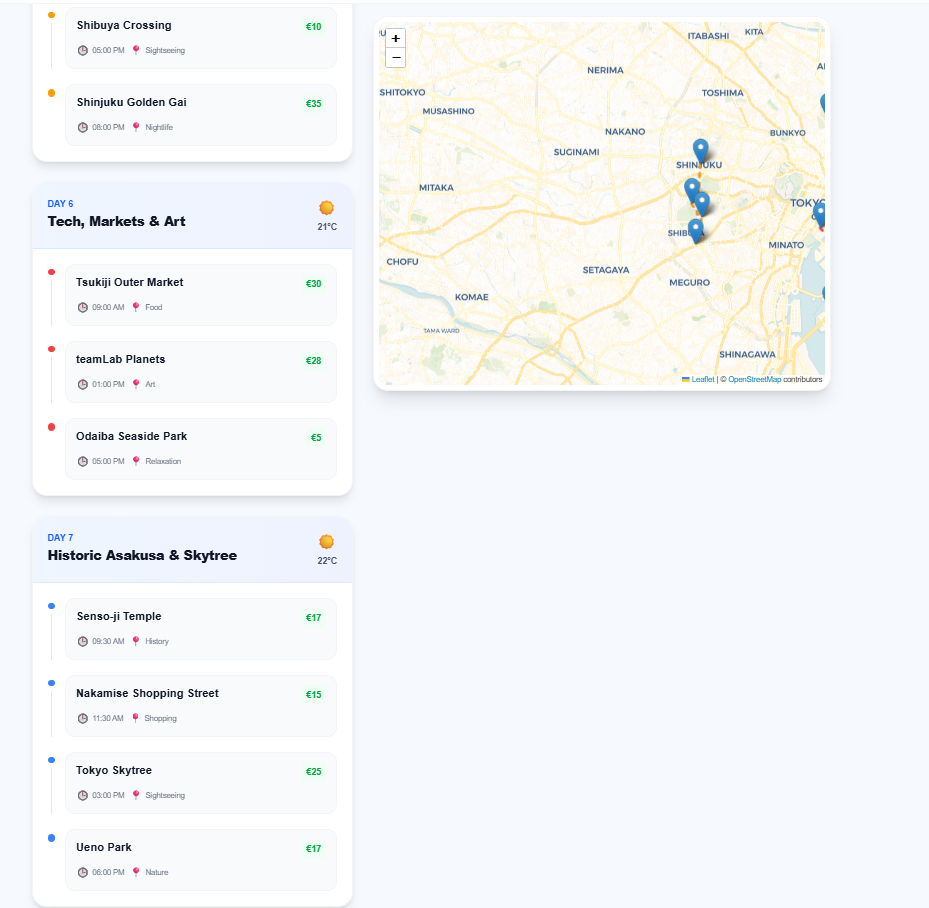
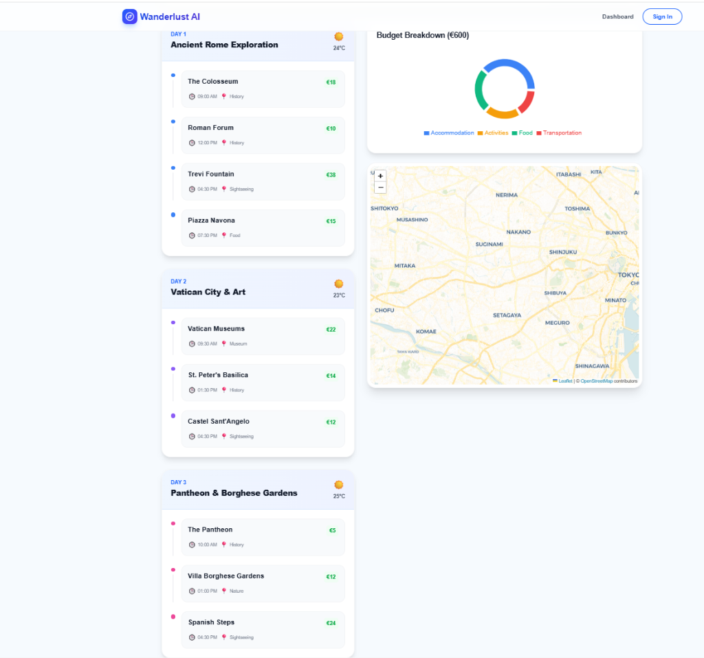

# 🌍 Wanderlust AI - Travel Itinerary Generator

Wanderlust AI is an AI-powered travel itinerary generator that creates customized trip plans based on your destination, budget, duration, and personal interests.

## 📸 Screenshots

### 🏠 Landing Page & Features


### ✍️ Start Planning Form


### 🗺️ Live Generated Itinerary Samples
Below are examples of beautiful itineraries generated by Wanderlust AI:

| 🥖 Paris, France (3 Days) | 🍣 Tokyo, Japan (7 Days) |
|---|---|
|  |  <br><br>  <br><br>  |

| 🍕 Rome, Italy (3 Days) |
|---|
|  |

## 🏗️ Architecture

This repository is a monorepo containing both the frontend and backend services:

- **`travel-frontend/`**: The frontend web application built with Next.js, React, Tailwind CSS, and Leaflet maps.
- **`travel-itinerary-backend/`**: The backend API built with Python and FastAPI, handling AI generation and database operations.

---

## 💻 Frontend Setup (Next.js)

### Prerequisites
- Node.js (v18+)
- npm or yarn

### Installation
1. Navigate to the frontend directory:
   ```bash
   cd travel-frontend
   ```
2. Install dependencies:
   ```bash
   npm install
   ```
3. Set up your environment variables. Create a `.env.local` file in the `travel-frontend` directory with your Firebase configuration:
   ```env
   NEXT_PUBLIC_FIREBASE_API_KEY=your_api_key
   NEXT_PUBLIC_FIREBASE_AUTH_DOMAIN=your_auth_domain
   NEXT_PUBLIC_FIREBASE_PROJECT_ID=your_project_id
   NEXT_PUBLIC_FIREBASE_STORAGE_BUCKET=your_storage_bucket
   NEXT_PUBLIC_FIREBASE_MESSAGING_SENDER_ID=your_messaging_sender_id
   NEXT_PUBLIC_FIREBASE_APP_ID=your_app_id
   NEXT_PUBLIC_API_URL=http://localhost:8000
   ```
4. Run the development server:
   ```bash
   npm run dev
   ```
5. Open [http://localhost:3000](http://localhost:3000) in your browser.

---

## ⚙️ Backend Setup (FastAPI)

### Prerequisites
- Python 3.9+
- Firebase Admin SDK Service Account Key

### Installation
1. Navigate to the backend directory:
   ```bash
   cd travel-itinerary-backend
   ```
2. Create and activate a virtual environment:
   ```bash
   python -m venv venv
   # On Windows:
   venv\Scripts\activate
   # On Mac/Linux:
   source venv/bin/activate
   ```
3. Install dependencies:
   ```bash
   pip install fastapi uvicorn firebase-admin pydantic
   # Add any ML dependencies as needed (e.g., openai, scikit-learn)
   ```
4. Place your Firebase `serviceAccountKey.json` inside the `travel-itinerary-backend` folder.
5. Run the API server:
   ```bash
   uvicorn main:app --reload
   ```
6. The API will be running at [http://localhost:8000](http://localhost:8000). You can view the API documentation at [http://localhost:8000/docs](http://localhost:8000/docs).

---

## 🚀 Deployment

- **Frontend:** Optimized for deployment on [Vercel](https://vercel.com). Ensure you configure `travel-frontend` as the Root Directory in Vercel settings and add all required environment variables.
- **Backend:** Can be deployed to services like Render, Railway, or Google Cloud Run. Update the `NEXT_PUBLIC_API_URL` in your frontend environment variables to point to the deployed backend URL.

## 📄 License
MIT
